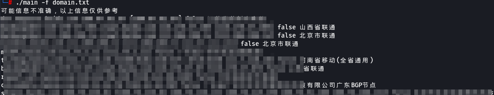
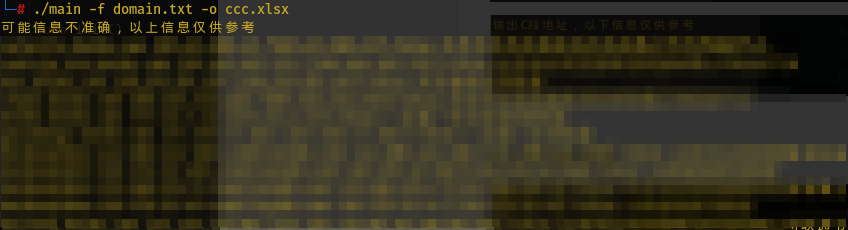

# wuming
通过域名获取C段信息
## 1.简介
下载地址[releases](https://github.com/liuzi-cyj/wuming/releases/tag/v0.0.1)

代码太烂了

## 2.主要功能

1.调用fofa获取域名去除CDN资产输出C段、地理位置以及匹配C段次数。

2.读取收集完成的域名，判断是否存在CDN输出段、地理位置以及匹配C段次数。

3.支持管道符命令，可通过subdomain收集域名通过管道

## 3.使用说明

**使用前请填写fofa邮箱和key**

**更新data下的ip数据库文件**https://99wry.cf/qqwry.dat


```
Please execute -h to view help
  -d string
        domain for example
  -f string
        domain file txt
  -o string
        Output all information to EXECL
```

-d

```
./wuming -d baidu.com
```

调用fofa收集域名和IP进行CDN判断，识别地理位置返回C段信息


-f

```
./wuming -f filename.txt
```

从文件中读取数据



-o

输出到Execl中



支持管道符号

```
cat domain.txt|wuming
```


```
./subfinder -d domain|./wuming
```


## 4.参考

https://github.com/zu1k/nali/

https://github.com/damit5/cdnCheck_go

https://github.com/EdgeSecurityTeam/Eeyes
